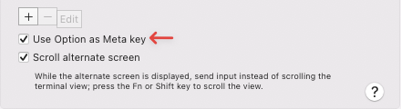

# Committed

[](https://github.com/mikelorant/committed/releases) [](https://github.com/mikelorant/committed/actions/workflows/release.yaml) [](https://spdx.org/licenses/MIT.html) [](https://codecov.io/gh/mikelorant/committed) [](https://www.codefactor.io/repository/github/mikelorant/committed)

Committed is a WYSIWYG Git commit editor that helps improve the quality of your
commits by showing you the layout in the same format as `git log`.

## [](#-highlights-) [](#-first-steps-) [](#-installation-) [](#-usage-) [](#-configuration-) [](#-best-practises-) [](#-shortcuts-)


## 💡 Highlights [⭡](#committed)

- Built-in **multiline editor** with rich capabilities.
- Custom **emoji selector** providing popular sets to choose from.
- **Switch author** before applying the commit.
- Inline **text interface** mimics the Git log output.
- Dynamic **subject line counter**.
- Toggle appending **sign-off** required by many open source projects.
- Automatically **hard wraps** body to 72 characters.
- Best practise **recommendations**.
- Import and **amend** previous commit.
- **Adaptive colours** with **light** and **dark** themes.

## 🐾 First Steps [⭡](#committed)

1. Install using Homebrew.

```shell
brew install mikelorant/committed/committed
```

2. Before creating and applying a commit you will need to stage the files you
   wish to add with the `git add` command.

3. Committed replaces the `git commit` command and all you need to do to commit
   your change is to run:

```shell
committed
```

It is also possible to amend your previous commit with:

```shell
committed --amend
```

Once the UI has appeared take note of the keyboard shortcuts shown at the bottom
of the interface.

```text
 Alt + <enter> Commit <s> Sign-off </> Help                Summary <tab>
Ctrl +     <c> Cancel                                       Author <tab> + Shift
```

These shortcuts will help you apply or cancel a commit and navigate between the
different components. Pressing enter on most components will automatically
switch you to the next one.

## 💬 Purpose [⭡](#committed)

The benefits of high quality commits are well documented however the tooling to
follow these practises has been lacking. In most cases you are either providing
a single line commit message or forced into a full screen editor which has no
knowledge of recommended Git practises.

It is common to accidentally commit to the wrong branch or use the incorrect
author name. Improving clarity of commits with emojis or detailed messages is
often frustrating.

For many, knowing what makes a good commit is not even thought about.

Committed attempts to solve these problems by first educating on best practises.
It then helps guide and enforce these de factor standards while showing how the
commit will end up being displayed to other users.

The interface does not take over the sceen or force switching to another
application. All actions are done with the keyboard which is consistent with the
Git command which is often used before the actual commit. Having an editor which
allows for more advanced cursor movement and editing assists with revising
rather than accepting what has already been written.

These capabilities all contribute to helping create a commit message that is
useful.

## ⚠️ Limitations [⭡](#committed)

### Option Key

The option key needs to be set to send the `meta` or `esc+` keycode. Terminals
such as macOS Terminal or iTerm2 may not have this as default. If not set
correctly it will not be possible to apply a commit.

To make these changes following the instructions below.

| Terminal       | Setting                                                      |
| :------------- | :----------------------------------------------------------- |
| macOS Terminal | `Profiles` `Keyboard`<br /> |
| iTerm2         | `Preferences` `Profile` `Keys`<br /> |

The alternative keyboard shortcut  <kbd>⌥ Option</kbd> + <kbd>\\</kbd> can also be used to apply
a commit.

### Rendering Borders

Terminals render emojis differently and this makes alignment of borders
complicated and difficult. It is an ongoing process to improve the compatibility
with terminals. The following list are the terminals that have been tested.
Other terminals may display correctly and feedback would be appreciated to help
update the list.

| Terminal       | Status                  |
| :------------- | :---------------------- |
| macOS Terminal | Compatible              |
| iTerm2         | Compatible              |
| VS Code        | Compatible              |
| Hyper          | Compatible              |
| Alacritty      | Compatible              |
| WezTerm        | Compatible              |
| Kitty          | Border alignment issues |

## 💾 Installation [⭡](#committed)

Install Committed with Homebrew.

```shell
brew install mikelorant/taps/committed
```

## 🎛 Usage [⭡](#committed)

```text
Committed is a WYSIWYG Git commit editor

Usage:
  committed [flags]
  committed [command]

Available Commands:
  completion   Generate the autocompletion script for the specified shell
  help         Help about any command
  list         List settings with profiles or IDs
  version      Print the version information

Flags:
      --config string     Config file location (default
                          "$HOME/.config/committed/config.yaml")
      --snapshot string   Snapshot file location (default
                          "$HOME/.local/state/committed/snapshot.yaml")
      --dry-run           Simulate applying a commit (default true)
  -a, --amend             Replace the tip of the current branch by creating a new commit
  -h, --help              help for committed
  -v, --version           version for committed

Use "committed [command] --help" for more information about a command.
```

## ⚙ Configuration [⭡](#committed)

No configuration is necessary however there are some values that can be changed
based on preference.

Committed defaults to using a config file located at `$HOME/.config/committed/config.yaml`.

```yaml
view:
  # Starting component focus.
  # Values: author, emoji, summary
  # Default: emoji
  focus: emoji

  # Emoji selector placement in relation to subject.
  # Values: above, below
  # Default: below
  emojiSelector: below

  # Emoji set to use.
  # Values: gitmoji, devmoji, emojilog
  # Default: gitmoji
  emojiSet: gitmoji

  # Theme to display. Dark and light backgrounds have different themes.
  # Dark values:
  #   builtin_dark, dracula, gruvbox_dark, nord, retrowave,
  #   solarized_dark_higher_contrast, tokyo_night
  # Dark default: builtin_dark
  # Light values:
  #   builtin_light, gruvbox_light, builtin_solarized_light,
  #   builtin_tango_light, tokyo_night_light
  # Light default: builtin_light
  theme: builtin_dark

  # Colour profile for displaying themes.
  # Values: adaptive, dark, light
  # Default: adaptive
  colour: adaptive

  # Terminal compatibility.
  # Values: default, ttyd
  # Default: default
  compatibility: default

  # Highlight active component.
  # Value: true, false
  # Default: false
  highlightActive: false

  # Ignore Git global author.
  # Value: true, false
  # Default: false
  ignoreGlobalAuthor: false

commit:
  # Emoji format in commit.
  # Values: shortcode, character
  # Default: shortcode
  emojiType: shortcode

  # Enable author sign-off for commits.
  # Values: true, false
  # Default: false
  signoff: false

authors:
  # List of extra authors.
  - name: John Doe
    email: john.doe@example.com
```

### Themes

There are a number of themes available that modify the colours. By default, the
background colour is detected which changes the choices of themes. This
detection can be disabled by setting the colour profile in the configuration.
The first theme of each set is the default theme applied.

#### Dark Themes

| Name                                                         | ID                             |
| :----------------------------------------------------------- | :----------------------------- |
| Builtin Dark                                                 | builtin_dark                   |
| [Dracula](https://draculatheme.com/)                         | dracula                        |
| [Gruvbox Dark](https://github.com/morhetz/gruvbox)           | gruvbox_dark                   |
| [Nord](https://www.nordtheme.com/)                           | nord                           |
| Retrowave                                                    | retrowave                      |
| [Solarized Dark Higher Contrast](https://ethanschoonover.com/solarized/) | solarized_dark_higher_contrast |
| [Tokyo Night](https://github.com/enkia/tokyo-night-vscode-theme) | tokyo_night                    |

#### Light Theme

| Name                                                                      | ID                      |
| :------------------------------------------------------------------------ | :---------------------- |
| Builtin Light                                                             | builtin_light           |
| [Builtin Solarized Light](https://ethanschoonover.com/solarized/)         | builtin_solarized_light |
| [Builtin Tango Light](http://tango.freedesktop.org/Tango_Desktop_Project) | builtin_tango_light     |
| [Gruvbox Light](https://github.com/morhetz/gruvbox)                       | gruvbox_light           |
| [Tokyo Night Light](https://github.com/enkia/tokyo-night-vscode-theme)    | tokyo_night_light       |

### Emoji Profiles

Popular emoji sets can be set as the default profile:

- [Gitmoji](https://gitmoji.dev/)
- [Devmoji](https://github.com/folke/devmoji)
- [Emoji-Log](https://github.com/ahmadawais/emoji-log)

## 🏆 Best Practises [⭡](#committed)

To create a well formed commit, these are some of the best practises that are
often cited.

> Capitalized, short (50 chars or less) summary
>
> More detailed explanatory text, if necessary.  Wrap it to about 72
> characters or so.  In some contexts, the first line is treated as the
> subject of an email and the rest of the text as the body.  The blank
> line separating the summary from the body is critical (unless you omit
> the body entirely); tools like rebase can get confused if you run the
> two together.
>
> Write your commit message in the imperative: "Fix bug" and not "Fixed bug"
> or "Fixes bug."  This convention matches up with commit messages generated
> by commands like git merge and git revert.
>
> Further paragraphs come after blank lines.
>
> - Bullet points are okay, too
>
> - Typically a hyphen or asterisk is used for the bullet, followed by a
>   single space, with blank lines in between, but conventions vary here
>
> - Use a hanging indent

Source: [Tim Pope](https://tbaggery.com/2008/04/19/a-note-about-git-commit-messages.html)

The placeholder text for the summary and body will show these recommendations.

Related links:

- [Joel Parker Henderson](https://github.com/joelparkerhenderson/git-commit-message)
- [Chris Beams](https://cbea.ms/git-commit/)

## ⌨ Shortcuts [⭡](#committed)

The global shortcuts can be used within any view.

| Key Binding                              | Command            |
| :--------------------------------------- | :----------------- |
| <kbd>⌥ Option</kbd> + <kbd>⏎ Enter</kbd> | Commit             |
| <kbd>⌥ Option</kbd> + <kbd>\\</kbd>      | Commit             |
| <kbd>⌥ Option</kbd> + <kbd>S</kbd>       | Toggle sign-off    |
| <kbd>⌥ Option</kbd> + <kbd>T</kbd>       | Toggle theme       |
| <kbd>⌥ Option</kbd> + <kbd>/</kbd>       | Help               |
| <kbd>⌥ Option</kbd> + <kbd>1</kbd>       | Focus author       |
| <kbd>⌥ Option</kbd> + <kbd>2</kbd>       | Focus emoji        |
| <kbd>⌥ Option</kbd> + <kbd>3</kbd>       | Focus summary      |
| <kbd>⌥ Option</kbd> + <kbd>4</kbd>       | Focus body         |
| <kbd>⌃ Control</kbd> + <kbd>C</kbd>      | Cancel             |
| <kbd>⇥ Tab</kbd>                         | Next component     |
| <kbd>⇧ Shift</kbd> + <kbd>⇥ Tab</kbd>    | Previous component |

The emoji shortcuts are limited to the emoji view only.

| Key Binding            | Command       |
| :--------------------- | :------------ |
| <kbd>⌫ Delete</kbd>    | Clear emoji   |
| <kbd>⎋ Escape</kbd>    | Reset filter  |
| <kbd>⇟ Page Down</kbd> | Next page     |
| <kbd>⇞ Page Up</kbd>   | Previous page |

## 📚 Tips [⭡](#committed)

### Aliases

Shell or Git aliases can be used to tailor Committed to your preferred workflow.
An example Git alias is as follows:

```shell
git config --global alias.co '! committed'
```

You can then commit changes with:

```shell
git co
```

### Amend

There are certain limitations when amending commits and it is recommended only
for use with commits created with Committed. The limitations are:

- Emoji character or shortcode must be in the existing data set.
- Trailers will be imported into the body.
- Summary will be truncated if more than 72 characters.
- Lines will not reflow when editing the body.

## ✏️ Authors [⭡](#committed)

- [@mikelorant](https://www.github.com/mikelorant)

## 🎫 License [⭡](#committed)

[MIT](https://choosealicense.com/licenses/mit/)

## 👍 Thanks [⭡](#committed)

Thanks to [Carlos Cuesta](https://github.com/carloscuesta) for creating [gitmoji](https://gitmoji.dev/) and [gitmoji-cli](https://github.com/carloscuesta/gitmoji-cli) which was the
inspiration for this project.

Thanks to [Ahmad Awais](https://github.com/ahmadawais) for [Emoji-Log](https://github.com/ahmadawais/Emoji-Log) and [Folke Lemaitre](https://github.com/folke) for [Devmoji](https://github.com/folke/devmoji).

Many thanks to [David Ackroyd](https://github.com/dackroyd) and [Matt Hope](https://github.com/matthope) for all their guidance with Go.
Without their expertise I would never had the capability to build Committed.

Thanks to all the developers from [Charm](https://github.com/charmbracelet) for their amazing set of libraries.
Committed would never have looked the way it does without [Bubble Tea](https://github.com/charmbracelet/bubbletea), [Lipgloss](https://github.com/charmbracelet/lipgloss)
and [Bubbles](https://github.com/charmbracelet/bubbles).

Thanks to [Tim Pope](https://github.com/tpope) for his Git commit recommendations which was a core
component in the interface design.
